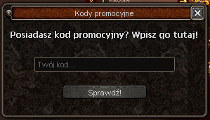
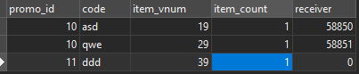

# Metin2 promotion code system
This is a project of Metin2 promotion code system. With this addition player can get an item by putting a set code into the window. 



## Installation
Code reaches many files. To make it clean and easy to understand I prepared tutorial what you are supposed to do in order to implement system correctly.

## Usage
This is a simple call to open window in game.

```python
'''game.py'''

    onPressKeyDict[app.DIK_F5]	= lambda : self.__OpenPromoCodeDialog()

    def __OpenPromoCodeDialog(self):
        self.interface.wndPromoCode.Show()
```

## SQL configuration

Example config is shown above. For example, you put promo_id 10, you can add unlimited amount of codes related to this promo, each of code has unique item vnum and count. Player x can only receive 1 item from 1 promo, if you get an item from promo 10, you can't use another code from promo 10, but you can use code for promo, let's say, 11.

## Contact
If you encounter any problems while adding or using software, or you are looking for help, don't hasitate, write to me!

Discord: [filip.wiesek#8116](https://discordapp.com/users/308322910034984962)

Skype: [pogodynkafw](https://join.skype.com/invite/d8sCTUrbBc6K)

## License
[License](https://gitlab.com/filip-systems/metin2-promo-code/-/blob/master/LICENSE)

## Changelog
[Changelog](https://gitlab.com/filip-systems/metin2-promo-code/-/blob/master/CHANGELOG.md)